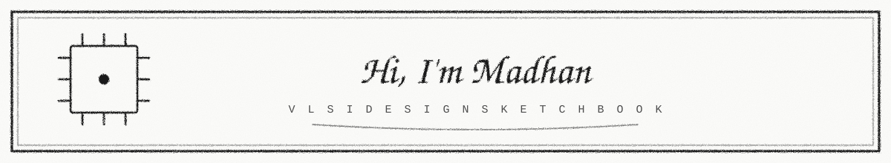

> *Final-year undergraduate focused on VLSI, RTL design, and digital verification.*
>
> *Currently building RTL designs in Verilog, including combinational logic, FSMs, memories, arithmetic units, and communication protocols such as APB, I²C, SPI, and UART.*

- 🔧 `Verilog` `SystemVerilog` `C`
- 🛠️ `Vivado` `Icarus Verilog` `GTKWave` `EDA Playground`
- ⚡ `FPGA` `RTL Design` `Digital Verification`

